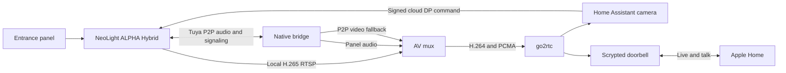

# Architecture and protocol notes

The HA integration reads the monitor's local web UI to report availability.
With an app profile, it also reads the paired Tuya device schema and values
through the NeoLight mobile API. HA derives a stable client installation ID
from that profile to avoid sharing the phone app's SID. The integration exposes
only relay controls present and writable in the paired device's schema. It
resolves the relay DP from the **live schema** before each button press,
confirms the device is online and the DP is inactive, then sends one command.
The cloud acknowledgement does not prove
that the physical lock moved. On the tested Vizit adapter, Lock 1 opened the
door during an active call. Lock 2's target is unknown.

The ring event uses the cloud `alarm_message` DP. One captured Vizit call
contained a snapshot filename with a Unix timestamp one second before the
observed MQTT update. The event parser requires that timestamp to be recent,
newer than the current HA runtime, and attached to a snapshot path it has not
seen. This rejects the stale value previously replayed after reconnecting.
The cloud DP is still polled and can miss a call. A supervised Vizit call
physically opened Lock 1 after one timestamped event and one cloud command.
The HA event detector correlates that snapshot with an active-call transition
so the two reports of one call produce one ring event and at most one automatic
release attempt. It also ignores an active call already present when HA starts.
Signals within 20 seconds are merged conservatively, which can hide a very
quick second call. This correlation does not make cloud polling lossless.
Automatic unlock is off by default and requires the HA switch. Each command
requires a timestamped snapshot captured within ten seconds. An app
`callStatus` transition can announce a call, but cannot open a door by itself.
If it arrives before the snapshot, the later validated snapshot can still
release once for that call. The one-time test expires after
fifteen minutes and disarms after its first attempt.

The native bridge uses `tuya-ipc-p2p-sdk` for its encrypted session. It signs
in with a stable installation identity separate from HA's API client, so a
refresh of one SID does not invalidate the other. It
publishes panel audio as PCMA/8000 and sends Apple Home microphone samples
back as PCMU/8000 while talk is active. The local monitor RTSP MainStream is
transcoded from H.265 to H.264. The mux combines that video with panel audio
in `neolight_door_with_audio`. Scrypted reads this shared stream and forwards
talk to the native bridge's loopback socket. The P2P video path is a fallback
with a lower observed frame rate.

The media and relay paths were derived from one owner-authorized app and
monitor. Protocol names here describe observed behavior for that pair;
device-specific capabilities are checked at runtime. Capture files, app
secrets, account details, and private addresses are intentionally absent from
the repository.
