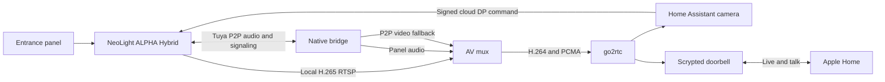

# Architecture and protocol notes

The HA integration reads the monitor's local web UI to report availability.
With an app profile, it also reads the paired Tuya device schema and values
through the NeoLight mobile API. It resolves the relay DP from the **live
schema** before each button press, confirms the device is online and the DP
is inactive, then sends one command. The cloud acknowledgement does not prove
that the physical lock moved. On the tested Vizit adapter, Lock 1 opened the
door during an active call. Lock 2's target is unknown.

The current ring event uses the cloud `alarm_message` DP. It has no trustworthy
event timestamp and an old value was replayed after reconnecting. A
deduplicator suppresses values already seen by the running HA process, but
that alone is insufficient for automatic release. Auto unlock remains held
off in code. A future call receiver must establish a fresh call identifier
and a bounded, single-use release window before this can be enabled.

The native bridge uses `tuya-ipc-p2p-sdk` for its encrypted session. It
publishes panel audio as PCMA/8000 and sends Apple Home microphone samples
back as PCMU/8000 while talk is active. The local monitor RTSP MainStream is
transcoded from H.265 to H.264. The mux combines that video with panel audio
in `neolight_door_with_audio`. Scrypted reads this shared stream and forwards
talk to the native bridge's loopback socket. The P2P video path is a fallback
with a lower observed frame rate.

The media and relay paths were derived from one owner-authorized app and
monitor. Protocol names here describe observed behavior for that pair;
device-specific capabilities are checked at runtime. Capture files, app
secrets, account details, and private addresses are intentionally absent from
the repository.
